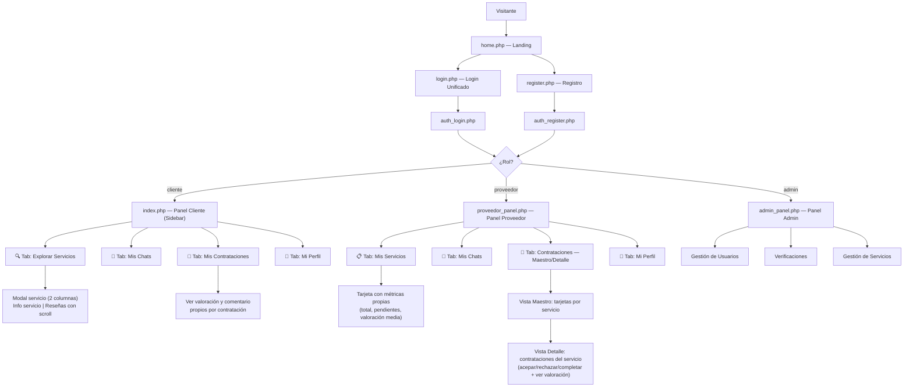

# 🔧 ServiJob — Análisis Completo del Sistema

**Última actualización**: Mayo 2026 — v2.2 (Sistema de Valoraciones, Reseñas y Navegación Maestro-Detalle)

## Visión General

**ServiJob** es un prototipo de plataforma web de **marketplace de servicios locales**, enfocado en el contexto venezolano (municipios de Caracas). Permite a clientes explorar y contactar proveedores de servicios, y a los proveedores gestionar sus ofertas.

- **Stack tecnológico**: PHP 8+ (sin framework), MySQL/MariaDB, HTML/CSS/JS Vanilla
- **Servidor requerido**: Apache/Nginx con PHP + MySQL (típicamente XAMPP/WAMP local)
- **Base de datos**: `service_libre`
- **Charset**: UTF-8 MB4

---

## 📁 Estructura de Archivos

| Archivo | Tipo | Descripción |
|---|---|---|
| `db.php` | Backend | Configuración y conexión a la BD |
| `database.sql` | SQL | Esquema completo de tablas + datos de ejemplo |
| `get_lists.php` | Backend | Helper para cargar listas dinámicas (municipios/categorías) |
| `get_reviews.php` | Backend | **[NUEVO v2.2]** Endpoint JSON: reseñas anonimizadas con badge de verificación por servicio |
| `auth_guard.php` | Backend | Middleware de autenticación y sesión |
| `auth_login.php` | Backend | Lógica de inicio de sesión unificada (cliente, proveedor y admin) |
| `auth_register.php` | Backend | Lógica de registro de usuarios |
| `logout.php` | Backend | Cierre de sesión seguro |
| `logic.php` | Backend | Query de servicios → genera tarjetas HTML con valoración media |
| `proveedor_actions.php` | Backend | CRUD de servicios del proveedor (crear/editar/eliminar) + cambio de contraseña |
| `contratacion_actions.php` | Backend | Gestión del ciclo de vida de contrataciones + envío de valoraciones |
| `cliente_actions.php` | Backend | Acciones del cliente: cambio de contraseña |
| `admin_actions.php` | Backend | Acciones del panel de administración |
| `admin_panel.php` | Frontend+BE | Panel del administrador con sidebar y pestañas |
| `proveedor_panel.php` | Frontend+BE | Panel del proveedor: Servicios (con métricas), Chats, Contrataciones (Maestro-Detalle), Perfil |
| `index.php` | Frontend+BE | **Panel de Cliente**: Explorar (modal 2 cols + reseñas), Chats, Mis Contrataciones, Perfil |
| `login.php` | Frontend | UI de inicio de sesión unificada |
| `home.php` | Frontend | Página de inicio / landing (~119 KB) |
| `register.php` | Frontend | Formulario de registro PHP |
| `reset_admin.php` | Utilidad | Recuperación de cuenta de administrador (**⚠️ BORRAR en producción**) |
| `fix_db.php` | Utilidad | Reparador/migrador de BD (**⚠️ BORRAR en producción**) |
| `verify.php` | Backend | Procesa solicitudes de verificación de proveedor |
| `ver_doc.php` | Backend | Visualización segura de documentos |
| `chat_get.php` | Backend | Sistema de mensajería — obtener mensajes |
| `chat_send.php` | Backend | Sistema de mensajería — enviar mensajes |
| `style_backend.css` | CSS | Estilos base del panel de administración |
| `uploads/` | Directorio | Imágenes subidas por los proveedores |
| `analisis_export.html` | Doc | Exportación del análisis en formato HTML |

---

## 🗄️ Base de Datos — `service_libre`

### Tabla `usuarios`

| Campo | Tipo | Notas |
|---|---|---|
| `id` | INT UNSIGNED PK | Auto-increment |
| `nombre` | VARCHAR(80) | Obligatorio |
| `apellido` | VARCHAR(80) | Opcional |
| `email` | VARCHAR(120) UNIQUE | Índice; usado para login |
| `telefono` | VARCHAR(30) | Opcional |
| `password` | VARCHAR(255) | Hash bcrypt |
| `role` | ENUM | `'cliente'`, `'proveedor'`, `'admin'` |
| `last_login` | DATETIME | Actualizado en cada login |
| `created_at` | DATETIME | Default `NOW()` |

### Tabla `servicios`

| Campo | Tipo | Notas |
|---|---|---|
| `id` | INT UNSIGNED PK | Auto-increment |
| `titulo` | VARCHAR(200) | Nombre del servicio |
| `descripcion` | TEXT | Nullable |
| `imagen` | VARCHAR(255) | Nombre del archivo en `uploads/` |
| `categoria` | VARCHAR(80) | Plomería, Electricidad, Comida... |
| `municipio` | VARCHAR(60) | Chacao, Baruta, Sucre, Libertador |
| `precio` | DECIMAL(10,2) | En USD |
| `usuario_id` | FK → usuarios | SET NULL si el usuario es borrado |
| `es_destacado` | TINYINT(1) | Flag para servicios destacados |
| `verificado` | TINYINT(1) | Flag de verificación por admin |
| `created_at` | DATETIME | Default `NOW()` |

### Tabla `verificaciones`

| Campo | Tipo | Notas |
|---|---|---|
| `id` | INT UNSIGNED PK | Auto-increment |
| `nombre` | VARCHAR(120) | Nombre del negocio |
| `municipio` | VARCHAR(60) | — |
| `doc_path` | VARCHAR(255) | Ruta del documento de identidad |
| `estado` | ENUM | `'pendiente'`, `'aprobado'`, `'rechazado'` |
| `usuario_id` | FK → usuarios | Nullable |
| `created_at` | DATETIME | — |

### Tabla `contrataciones`

| Campo | Tipo | Notas |
|---|---|---|
| `id` | INT UNSIGNED PK | Auto-increment |
| `servicio_id` | FK → servicios | Servicio contratado |
| `cliente_id` | FK → usuarios | Cliente que solicita |
| `proveedor_id` | FK → usuarios | Proveedor receptor |
| `estado` | ENUM | `'pendiente'`, `'aceptado'`, `'rechazado'`, `'completado'`, `'cancelado'` |
| `motivo` | TEXT | Nullable; motivo de rechazo o cancelación |
| `created_at` | DATETIME | Default `NOW()` |

### Tabla `valoraciones` — NUEVA v2.2

| Campo | Tipo | Notas |
|---|---|---|
| `id` | INT UNSIGNED PK | Auto-increment |
| `contratacion_id` | FK → contrataciones | Una valoración por contratación (UNIQUE) |
| `proveedor_id` | FK → usuarios | Proveedor valorado |
| `cliente_id` | FK → usuarios | Cliente que valora |
| `puntuacion` | TINYINT | 1 a 5 estrellas |
| `comentario` | TEXT | Nullable; texto libre del cliente |
| `created_at` | DATETIME | Default `NOW()` |

> La unicidad de `contratacion_id` en `valoraciones` garantiza que un cliente no pueda valorar dos veces la misma contratación.

### Tabla `chat_mensajes`

| Campo | Tipo | Notas |
|---|---|---|
| `id` | INT UNSIGNED PK | Auto-increment |
| `servicio_id` | FK → servicios | El servicio sobre el que se chatea |
| `cliente_id` | FK → usuarios | El usuario que inicia el chat |
| `proveedor_id` | FK → usuarios | El proveedor receptor |
| `emisor_id` | FK → usuarios | Quién envió cada mensaje |
| `mensaje` | TEXT | Contenido del mensaje |
| `leido` | TINYINT(1) | 0 = no leído, 1 = leído |
| `created_at` | DATETIME | Timestamp del mensaje |

> Un hilo de chat se identifica por la combinación `(servicio_id + cliente_id + proveedor_id)`.

### Usuario Admin por Defecto
- **Email**: `admin@servijob.com`
- **Password**: `admin1234`

---

## 👥 Roles y Flujos de Usuario



### Rol `cliente`
- Accede a `index.php` con layout de **sidebar y 4 pestañas**
- **Tab Explorar**: Ve todos los servicios en grid con barra sticky de búsqueda + filtros, paginación. Cada tarjeta muestra la valoración media del servicio. Al abrir un servicio, el modal se divide en 2 columnas: info + reseñas (con scroll independiente).
- **Tab Mis Chats**: Ve y retoma conversaciones abiertas con proveedores
- **Tab Mis Contrataciones**: Ve el historial de solicitudes de contratación. Si ya valoró una contratación, ve las estrellas y el comentario que dejó.
- **Tab Mi Perfil**: Cambia su contraseña, ve su estado de verificación, revisa historial de proveedores contactados
- El botón "Postular Verificación" disponible en el sidebar

### Rol `proveedor`
- Redirigido automáticamente a `proveedor_panel.php`
- Layout de **sidebar fijo** con 4 pestañas
- **Tab Mis Servicios**: ve sus estadísticas globales, crea/edita/elimina sus servicios con imagen. Cada tarjeta de servicio muestra un **bloque de métricas propio**: total de contrataciones, solicitudes pendientes y valoración media.
- **Tab Mis Chats**: ve todas las conversaciones activas con clientes y puede responder
- **Tab Contrataciones**: navegación **Maestro-Detalle**:
  - **Vista Maestro**: cuadrícula de tarjetas por servicio con métricas individuales
  - **Vista Detalle**: al hacer clic, muestra la lista de contrataciones de ese servicio con sus acciones (aceptar/rechazar/completar) y, si fue valorada, muestra estrellas + comentario del cliente
- **Tab Mi Perfil**: cambia su contraseña de forma segura
- Badge de no-leídos en chats; badge de pendientes en contrataciones
- **PENDIENTE**: Integración del flujo de postulación de verificación de identidad

### Rol `admin`
- Accede directamente a `admin_panel.php`
- Gestiona usuarios, verificaciones y servicios
- Puede acceder a `index.php?view=public` para ver el catálogo como visitante
- Accede de forma segura a los documentos subidos mediante `ver_doc.php`

---

## 🔐 Sistema de Autenticación

### Flujo Unificado

El sistema usa un **único punto de login** (`login.php` → `auth_login.php`). El campo `role` en la tabla `usuarios` determina la redirección:

- `admin` → `admin_panel.php`
- `proveedor` → `proveedor_panel.php`
- `cliente` → `index.php`

### `auth_guard.php` (Middleware)
- Aplica headers anti-caché
- Verifica que la sesión tenga `user_id`, `user_role` y `user_name`
- Si no es válida: destruye la sesión, borra la cookie, redirige a `login.php`
- Expone helpers: `esAdmin()`, `nombreUsuario()`, `idUsuario()`

### `auth_login.php`
- Solo acepta `POST`
- Login unificado sin bifurcación por rol
- Verifica contraseña con `password_verify()` (bcrypt)
- Actualiza `last_login` en login exitoso
- Redirige según rol del usuario

### `auth_register.php`
- Validaciones: campos requeridos, email válido, contraseñas coinciden, mínimo 6 caracteres, email único
- Hashea con `PASSWORD_BCRYPT`
- Si es proveedor: crea automáticamente un servicio inicial
- Inicia sesión y redirige según rol

### `logout.php`
- Destruye sesión con `session_unset()` + `session_destroy()`
- Invalida la cookie de sesión explícitamente
- Headers anti-caché → Redirige a `login.php`

---

## ⭐ Módulo de Valoraciones y Reseñas — v2.2

### Flujo de Valoración
1. El proveedor marca una contratación como **Completada**.
2. El cliente ve el botón "⭐ Valorar Servicio" en su pestaña "Mis Contrataciones".
3. El cliente selecciona de 1 a 5 estrellas y opcionalmente deja un comentario.
4. La valoración se guarda en la tabla `valoraciones` (una por contratación, garantizado por UNIQUE en `contratacion_id`).
5. El botón "Valorar" desaparece y se muestra el bloque de valoración con estrellas y comentario.

### Anonimización de Reseñas
- Los nombres se muestran como `Nombre + inicial del apellido` (ej. "María G.")
- Si el cliente tiene una verificación en estado `aprobado` en la tabla `verificaciones`, aparece un badge verde **"✔ Verificado"** junto a su nombre.

### Endpoint `get_reviews.php`
- **Parámetro**: `?servicio_id=X`
- **Respuesta JSON**:
  ```json
  {
    "ok": true,
    "promedio": 4.5,
    "total": 2,
    "reviews": [
      {
        "nombre": "Juan M.",
        "verificado": true,
        "puntuacion": 5,
        "comentario": "Excelente servicio",
        "fecha": "23/05/2026"
      }
    ]
  }
  ```

### Impacto en la UI
| Vista | Cambio |
|---|---|
| Tarjetas del catálogo (`logic.php`) | Muestran valoración media y total de reseñas |
| Modal de servicio (`index.php`) | Columna derecha con sección de reseñas (scroll propio) |
| Mis Contrataciones — Cliente | Bloque con estrellas y comentario propio si ya valoró |
| Mis Servicios — Proveedor | Bloque de métricas por tarjeta (total, pendientes, valoración media) |
| Contrataciones Detalle — Proveedor | Muestra la valoración y comentario recibido por contratación |

---

## ⚙️ CRUD de Servicios — `proveedor_actions.php`

Solo acepta requests de usuarios con rol `proveedor`. Todas las operaciones verifican que el servicio pertenezca al usuario autenticado (`usuario_id = $uid`).

| Acción (`action`) | Método | Descripción |
|---|---|---|
| `create` | POST | Inserta nuevo servicio con imagen opcional |
| `update` | POST | Actualiza servicio, reemplaza imagen si se sube nueva |
| `delete` | POST | Elimina servicio y borra el archivo de imagen del disco |

**Subida de imágenes** (`subirImagen()`):
- Formatos: JPG, JPEG, PNG, WEBP, GIF
- Tamaño máximo: 2MB
- Nombre: `uniqid('srv_', true)` + extensión
- Directorio: `uploads/`

---

## ⚙️ Gestión de Contrataciones — `contratacion_actions.php`

| Acción (`action`) | Quién puede | Descripción |
|---|---|---|
| `aceptar` | Proveedor | Cambia estado a `aceptado` |
| `rechazar` | Proveedor | Cambia estado a `rechazado` + guarda motivo |
| `completar` | Proveedor | Cambia estado a `completado` |
| `cancelar` | Cliente | Cambia estado a `cancelado` (solo si pendiente o aceptado) |
| `valorar` | Cliente | Inserta en `valoraciones` (solo si estado = `completado` y sin valoración previa) |

---

## ⚙️ Acciones del Cliente — `cliente_actions.php`

| Acción (`action`) | Método | Descripción |
|---|---|---|
| `change_password` | POST | Verifica contraseña actual y actualiza el hash en BD |

Redirige a `index.php?tab=perfil&ok=1` en éxito o `?err=1` en fallo.

---

## 💬 Módulo de Chat

El chat es una ventana flotante (`#chatWindow`) que funciona con **polling** (intervalo de 3s).

### Backend
- **`chat_get.php`**: Recibe `servicio_id`, `cliente_id`, `proveedor_id`. Devuelve JSON con todos los mensajes del hilo. Marca como leídos los mensajes del otro usuario al consultar.
- **`chat_send.php`**: Recibe el mismo trío + `mensaje`. Inserta en `chat_mensajes` y devuelve el mensaje insertado.

### Frontend — Cliente (`index.php`)
- **Desde catálogo**: Abre modal de servicio → botón "Contactar por Chat" → llama `abrirChatDesdeModal()`.
- **Desde Tab Mis Chats**: Lista de conversaciones activas → click → llama `abrirChatDesdeLista(ctx)`.
- La ventana de chat es reutilizada en ambos casos.

### Frontend — Proveedor (`proveedor_panel.php`)
- Sección "Mensajes de Clientes" muestra lista de hilos activos con badge de no-leídos.
- Click en una conversación → llama `abrirConversacion(ctx)` → abre ventana flotante.

---

## 🎨 Diseño y Frontend

### Paleta de colores
- Fondo oscuro: `#0c1840` (navy profundo)
- Acento azul: `#2d5be3` / `#3d7af5`
- Acento naranja: `#f5820d`
- Acento verde: `#4ade80` (badges de verificación y estado completado)
- Acento ámbar: `#f59e0b` (estrellas de valoración)
- Texto secundario: `#8898bb`

### Tipografías (Google Fonts)
- **Rajdhani** (500, 600, 700) — Títulos y logos
- **DM Sans** (300, 400, 500, 600) — Cuerpo de texto

### Layout — Panel de Cliente (`index.php`)
- **Sidebar** fijo de 260px con 4 ítems de navegación:
  - 🔍 Explorar Servicios → `?tab=explorar`
  - 💬 Mis Chats → `?tab=chats` (badge de no leídos)
  - 🤝 Mis Contrataciones → `?tab=contratos` (badge de pendientes)
  - 👤 Mi Perfil → `?tab=perfil`
- **Barra Sticky** en Tab Explorar: búsqueda + filtros con efecto glassmorphism.
- **Modal de Servicio** (2 columnas desde v2.2):
  - Izquierda: imagen, título, descripción, precio, botones de contacto/contratar
  - Derecha: sección "⭐ Opiniones de clientes" con scroll independiente (carga dinámica vía `fetch`)
- **Botón FAB "↑"**: aparece al hacer scroll > 300px.

### Layout — Panel del Proveedor (`proveedor_panel.php`)
- **Sidebar** fijo de 260px con 4 ítems de navegación:
  - 📋 Mis Servicios → `?tab=servicios`
  - 💬 Mis Chats → `?tab=chats` (badge de no leídos)
  - 🤝 Contrataciones → `?tab=contratos` (badge de pendientes)
  - 👤 Mi Perfil → `?tab=perfil`
- **Tab Mis Servicios**: grid de tarjetas con bloque de métricas (total contrataciones, pendientes, valoración media).
- **Tab Contrataciones** — patrón Maestro-Detalle:
  - Vista Maestro: `#vista-maestro-contratos` — cuadrícula de tarjetas por servicio
  - Vista Detalle: `#detalle-[id]` — lista de clientes del servicio, con botón "⬅ Volver"
  - Transición manejada por JS: `mostrarDetalleContrato(id)` / `ocultarDetalleContrato()`

### Layout — Panel de Admin (`admin_panel.php`)
- Sidebar + pestañas con parámetro `?tab=`
- Pestañas: Usuarios, Verificaciones, Servicios, Estadísticas

---

## ⚠️ Observaciones y Puntos de Mejora

> [!NOTE]
> **Login Unificado** — El sistema ya no tiene botón/modal separado para admin. Un solo formulario de login en `login.php` redirige según el `role` de la BD.

> [!NOTE]
> **Unicidad de valoraciones** — La tabla `valoraciones` tiene un índice UNIQUE en `contratacion_id`, lo que garantiza a nivel de base de datos que no se puedan doble-valorar contrataciones.

> [!TIP]
> **Conexión BD en texto plano** — Las credenciales en `db.php` usan `root` sin contraseña, ideal para desarrollo local pero debe cambiarse para producción. Considerar variables de entorno.

> [!WARNING]
> **[DT-0] Deuda base pendiente** — El módulo de auditoría de chats (para que el admin pueda monitorear conversaciones) está planificado pero no implementado aún.

> [!IMPORTANT]
> **[DT-1] Verificación de servicios por pasos** — Los proveedores como personas deben seguir el mismo proceso de verificación de identidad que los clientes. Adicionalmente, los servicios que publican deben pasar por un flujo de verificación propio de 3 pasos:
> 1. Tener el **perfil de proveedor verificado** (identidad aprobada por admin).
> 2. Subir **al menos 3 fotos** del servicio que publicitan.
> 3. Después de **10 ventas exitosas**, mantener un **promedio mínimo de 85 puntos** en valoraciones.
> Archivos afectados: `servicios` (BD), `proveedor_panel.php`, `proveedor_actions.php`, `admin_panel.php`, `admin_actions.php`.

> [!IMPORTANT]
> **[DT-2] Chats por servicio** — El chat debe estar vinculado al servicio y NO al proveedor directamente. Un proveedor con varios servicios (ej. plomería y arte) tendrá hilos de chat completamente separados por cada servicio, aunque el cliente sea el mismo. El identificador de hilo cambia de `(servicio_id + cliente_id + proveedor_id)` a `(servicio_id + cliente_id)`. Requiere migración de la tabla `chat_mensajes` y actualización de `chat_get.php`, `chat_send.php`, `index.php` y `proveedor_panel.php`.

> [!IMPORTANT]
> **[DT-3] Mejoras al panel de administración** — El admin debe poder ver el perfil completo de cada usuario (proveedor o cliente), incluyendo: datos personales, servicios publicados, chats asociados a cada servicio y métricas de actividad. Requiere nuevas vistas detalladas dentro de `admin_panel.php` y nuevos endpoints en `admin_actions.php`.

> [!IMPORTANT]
> **[DT-4] Archivar chats** — Tanto clientes como proveedores deben poder archivar conversaciones. Los chats archivados no se eliminan; simplemente se ocultan de la bandeja principal y son accesibles desde una sección o filtro "Archivados". Requiere un nuevo campo (ej. `archivado_cliente`, `archivado_proveedor`) en `chat_mensajes` o una tabla auxiliar, más actualización de UI en `index.php` y `proveedor_panel.php`.

---

## 🗺️ Mapa de Rutas

```
/
├── home.php                ← Landing page
├── login.php               ← UI Login (unificado, un solo formulario)
│   └── auth_login.php      ← Procesa login → redirige según rol
├── register.php            ← UI Registro PHP
│   └── auth_register.php   ← Procesa registro
├── index.php               ← Panel Cliente (🔒 protegido)
│   ├── logic.php           ← Genera tarjetas de servicios (con avg_rating)
│   ├── get_reviews.php     ← [NUEVO v2.2] API JSON de reseñas anonimizadas
│   ├── chat_get.php        ← Chat: Obtener mensajes
│   ├── chat_send.php       ← Chat: Enviar mensajes
│   ├── cliente_actions.php ← Cambio de contraseña
│   └── contratacion_actions.php ← Ciclo de vida de contrataciones + valorar
├── proveedor_panel.php     ← Panel Proveedor (🔒 protegido)
│   ├── proveedor_actions.php ← CRUD servicios
│   └── contratacion_actions.php ← Gestión de contrataciones
├── admin_panel.php         ← Panel Admin (🔒 protegido)
│   ├── admin_actions.php   ← Acciones admin
│   └── ver_doc.php         ← Visualizador de documentos
├── verify.php              ← Procesa solicitudes de verificación
├── logout.php              ← Cierra sesión
├── db.php                  ← Conexión BD
├── get_lists.php           ← Listas dinámicas (municipios/categorías)
├── auth_guard.php          ← Middleware sesión
├── style_backend.css       ← Estilos base admin
├── reset_admin.php         ← ⚠️ (BORRAR en producción)
├── fix_db.php              ← ⚠️ (BORRAR en producción)
└── uploads/                ← Imágenes de servicios
```
