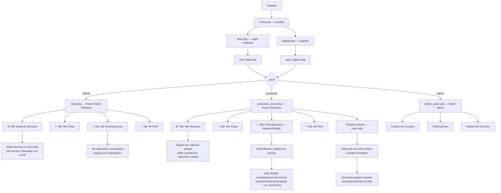

# 🔧 ServiJob — Análisis Completo del Sistema

**Última actualización**: Junio 12 - 2026 — v2.6.0 (Modo Cliente para Proveedores, compatibilidad móvil total, corrección de logo bicolor, protección anti-autocontratación en backend)

## Visión General

**ServiJob** es un prototipo de plataforma web de **marketplace de servicios locales**, enfocado en el contexto venezolano (municipios de Caracas). Permite a clientes explorar y contactar proveedores de servicios, y a los proveedores gestionar sus ofertas.

- **Stack tecnológico**: PHP 8+ (sin framework), MySQL/MariaDB, HTML/CSS/JS Vanilla
- **Servidor requerido**: Apache/Nginx con PHP + MySQL (típicamente XAMPP/WAMP local)
- **Base de datos**: `service_libre`
- **Charset**: UTF-8 MB4

---

## 📁 Estructura de Archivos

| Archivo / Directorio | Tipo | Descripción |
|---|---|---|
| `index.php` | Frontend+BE | **Panel de Cliente/Modo Cliente**: Explorar, Chats, Mis Contrataciones, Perfil |
| `home.php` | Frontend | Página de inicio / landing (~119 KB) |
| `login.php` | Frontend | UI de inicio de sesión unificada |
| `register.php` | Frontend | Formulario de registro PHP |
| `logout.php` | Backend | Cierre de sesión seguro |
| `app/core/db.php` | Backend | Configuración y conexión a la BD + helper global `audit()` |
| `app/core/auth_guard.php` | Backend | Middleware de autenticación y sesión |
| `app/auth/auth_login.php` | Backend | Lógica de inicio de sesión unificada (cliente, proveedor y admin) |
| `app/auth/auth_register.php`| Backend | Lógica de registro de usuarios |
| `app/actions/*_actions.php`| Backend | Controladores de acciones (POST handlers) para admin, proveedor, cliente y contrataciones |
| `app/api/*_get.php / *_send.php`| API | Endpoints JSON para mensajería, listas y reseñas |
| `app/pages/admin_panel.php` | Frontend+BE | Panel del administrador con sidebar y pestañas |
| `app/pages/proveedor_panel.php`| Frontend+BE| Panel del proveedor: Servicios (con métricas), Chats, Contrataciones, Perfil |
| `app/pages/logic.php` | Backend | Query de servicios → genera tarjetas HTML con valoración media |
| `app/pages/verify.php` | Backend | Procesa solicitudes de verificación de proveedor |
| `app/pages/ver_doc.php` | Backend | Visualización segura de documentos |
| `public/css/*.css` | CSS | Archivos de estilos extraídos (home, index, login, register, paneles) y estilos base |
| `public/fonts/` | Assets | Fuentes web (.woff2) |
| `public/libs/` | Assets | Librerías JS externas |
| `database/service_libre.sql`| SQL | Esquema completo de tablas + datos de ejemplo |
| `docs/` | Documentación | Análisis del sistema y exportación HTML |
| `scripts/` | Utilidades | Scripts de desarrollo (reparador BD, reset admin) y exportación Python |
| `uploads/` | Directorio | Imágenes subidas por los proveedores |

---

## 🗄️ Base de Datos — `service_libre`

### Tabla `usuarios`

| Campo | Tipo | Notas |
|---|---|---|
| `id` | INT UNSIGNED PK | Auto-increment |
| `nombre` | VARCHAR(80) | Obligatorio |
| `apellido` | VARCHAR(80) | Default `''` |
| `email` | VARCHAR(120) UNIQUE | Índice; usado para login |
| `telefono` | VARCHAR(30) | Default `''` |
| `password` | VARCHAR(255) | Hash bcrypt |
| `role` | ENUM | `'cliente'`, `'proveedor'`, `'admin'` |
| `last_login` | DATETIME | Actualizado en cada login exitoso |
| `created_at` | DATETIME | Default `NOW()` |
| `updated_at` | DATETIME | ON UPDATE `current_timestamp()` |
| `deleted_at` | DATETIME | NULL = activo; fecha = soft-deleted |
| `suspendido_at` | DATETIME | **[v2.5]** NULL = activo; fecha = suspendido desde esa fecha |

### Tabla `servicios`

| Campo | Tipo | Notas |
|---|---|---|
| `id` | INT UNSIGNED PK | Auto-increment |
| `titulo` | VARCHAR(200) | Nombre del servicio |
| `descripcion` | TEXT | Nullable |
| `imagen` | VARCHAR(255) | Nombre del archivo en `uploads/` |
| `categoria` | VARCHAR(80) | Plomería, Electricidad, Comida... (FK lógica a `categorias`) |
| `municipio` | VARCHAR(60) | Chacao, Baruta, Sucre, Libertador (FK lógica a `municipios`) |
| `precio` | DECIMAL(10,2) | En USD |
| `usuario_id` | FK → usuarios | SET NULL si el usuario es borrado |
| `es_destacado` | TINYINT(1) | Flag para servicios destacados |
| `verificado` | TINYINT(1) | Flag de verificación por admin |
| `created_at` | DATETIME | Default `NOW()` |
| `updated_at` | DATETIME | ON UPDATE `current_timestamp()` |
| `deleted_at` | DATETIME | NULL = activo; fecha = soft-deleted por admin |

### Tabla `verificaciones`

| Campo | Tipo | Notas |
|---|---|---|
| `id` | INT UNSIGNED PK | Auto-increment |
| `nombre` | VARCHAR(120) | Nombre del negocio |
| `municipio` | VARCHAR(60) | — |
| `doc_path` | VARCHAR(255) | Ruta del documento de identidad |
| `estado` | ENUM | `'pendiente'`, `'aprobado'`, `'rechazado'` |
| `usuario_id` | FK → usuarios | Nullable |
| `created_at` | DATETIME | — |

### Tabla `contrataciones`

| Campo | Tipo | Notas |
|---|---|---|
| `id` | INT UNSIGNED PK | Auto-increment |
| `servicio_id` | FK → servicios | Servicio contratado |
| `cliente_id` | FK → usuarios | Cliente que solicita |
| `proveedor_id` | FK → usuarios | Proveedor receptor |
| `estado` | ENUM | `'pendiente'`, `'aceptado'`, `'rechazado'`, `'completado'`, `'cancelado'` |
| `motivo` | TEXT | Nullable; motivo de rechazo o cancelación |
| `created_at` | DATETIME | Default `NOW()` |
| `updated_at` | DATETIME | ON UPDATE `current_timestamp()` — registra cada cambio de estado |

### Tabla `valoraciones` — NUEVA v2.2

| Campo | Tipo | Notas |
|---|---|---|
| `id` | INT UNSIGNED PK | Auto-increment |
| `contratacion_id` | FK → contrataciones | Una valoración por contratación (UNIQUE) |
| `proveedor_id` | FK → usuarios | Proveedor valorado |
| `cliente_id` | FK → usuarios | Cliente que valora |
| `puntuacion` | TINYINT | 1 a 5 estrellas |
| `comentario` | TEXT | Nullable; texto libre del cliente |
| `created_at` | DATETIME | Default `NOW()` |

> La unicidad de `contratacion_id` en `valoraciones` garantiza que un cliente no pueda valorar dos veces la misma contratación.

### Tabla `chat_mensajes`

| Campo | Tipo | Notas |
|---|---|---|
| `id` | INT UNSIGNED PK | Auto-increment |
| `servicio_id` | FK → servicios | El servicio sobre el que se chatea |
| `cliente_id` | FK → usuarios | El usuario que inicia el chat |
| `proveedor_id` | FK → usuarios | El proveedor receptor |
| `emisor_id` | FK → usuarios | Quién envió cada mensaje |
| `mensaje` | TEXT | Contenido del mensaje |
| `leido` | TINYINT(1) | 0 = no leído, 1 = leído |
| `created_at` | DATETIME | Timestamp del mensaje |
| `archivado_cliente` | TINYINT(1) | **[v2.5]** 0 = visible, 1 = archivado por el cliente |
| `archivado_proveedor` | TINYINT(1) | **[v2.5]** 0 = visible, 1 = archivado por el proveedor |

> Un hilo de chat se identifica por la combinación `(servicio_id + cliente_id + proveedor_id)`. La columna `proveedor_id` se conserva en la BD para integridad referencial aunque la lógica de UI filtra por `(servicio_id + cliente_id)`.

### Tabla `audit_log` — v2.5

| Campo | Tipo | Notas |
|---|---|---|
| `id` | INT UNSIGNED PK | Auto-increment |
| `usuario_id` | FK → usuarios (Nullable) | NULL si es acción del sistema |
| `tipo` | VARCHAR(60) | Código del evento (ej. `login`, `admin_delete_user`) |
| `entidad` | VARCHAR(40) | Tabla afectada (Nullable) |
| `entidad_id` | INT UNSIGNED | ID del registro afectado (Nullable) |
| `descripcion` | TEXT | Descripción legible del evento (Nullable) |
| `ip` | VARCHAR(45) | IP del cliente (Nullable) |
| `created_at` | DATETIME | Default `NOW()` — registro inmutable |

> La tabla `audit_log` es de solo inserción. El helper `audit()` definido en `db.php` escribe en ella silenciosamente sin interrumpir el flujo principal.

### Tabla `categorias`

| Campo | Tipo | Notas |
|---|---|---|
| `id` | INT UNSIGNED PK | Auto-increment |
| `nombre` | VARCHAR(80) | Nombre de la categoría (ej. Plomería, Electricidad) |

> El campo `categoria` en `servicios` almacena el nombre directamente como VARCHAR (no FK). Las listas se cargan dinámicamente desde esta tabla vía `get_lists.php`.

### Tabla `municipios`

| Campo | Tipo | Notas |
|---|---|---|
| `id` | INT UNSIGNED PK | Auto-increment |
| `nombre` | VARCHAR(60) | Nombre del municipio (ej. Chacao, Baruta) |

> El campo `municipio` en `servicios` y `verificaciones` almacena el nombre directamente como VARCHAR. Las listas se cargan dinámicamente desde esta tabla vía `get_lists.php`.

### Usuario Admin por Defecto
- **Email**: `admin@servijob.com`
- **Password**: `admin1234`

---

## 👥 Roles y Flujos de Usuario



### Rol `cliente`
- Accede a `index.php` con layout de **sidebar y 4 pestañas**
- **Tab Explorar**: Ve todos los servicios en grid con barra sticky de búsqueda + filtros, paginación. Cada tarjeta muestra la valoración media del servicio. Al abrir un servicio, el modal se divide en 2 columnas: info + reseñas (con scroll independiente).
- **Tab Mis Chats**: Ve y retoma conversaciones abiertas con proveedores
- **Tab Mis Contrataciones**: Ve el historial de solicitudes de contratación. Si ya valoró una contratación, ve las estrellas y el comentario que dejó.
- **Tab Mi Perfil**: Cambia su contraseña, ve su estado de verificación, revisa historial de proveedores contactados
- El botón "Postular Verificación" disponible en el sidebar

### Rol `proveedor`
- Redirigido automáticamente a `proveedor_panel.php` al iniciar sesión
- Layout de **sidebar fijo** con 4 pestañas + acceso a Modo Cliente
- **Tab Mis Servicios**: ve sus estadísticas globales, crea/edita/elimina sus servicios con imagen. Cada tarjeta de servicio muestra un **bloque de métricas propio**: total de contrataciones, solicitudes pendientes y valoración media.
- **Tab Mis Chats**: ve todas las conversaciones activas con clientes y puede responder
- **Tab Contrataciones**: navegación **Maestro-Detalle**:
  - **Vista Maestro**: cuadrícula de tarjetas por servicio con métricas individuales
  - **Vista Detalle**: al hacer clic, muestra la lista de contrataciones de ese servicio con sus acciones (aceptar/rechazar/completar) y, si fue valorada, muestra estrellas + comentario del cliente
- **Tab Mi Perfil**: cambia su contraseña de forma segura
- Badge de no-leídos en chats; badge de pendientes en contrataciones
- **Modo Cliente** (v2.6): botón en el sidebar "🔍 Cambiar a Modo Cliente" que permite al proveedor acceder a `index.php` para explorar, consultar y contratar servicios de otros proveedores. Sin necesidad de una segunda cuenta. Al navegar en modo cliente, el sidebar muestra el botón "⚙️ Volver a Modo Proveedor".
  - Los servicios propios del proveedor muestran los botones de contacto/contratar deshabilitados en la vista de cliente.
  - Protección anti-autocontratación a nivel de backend en `contratacion_actions.php` y `chat_send.php`.

### Rol `admin`
- Accede directamente a `admin_panel.php`
- Gestiona usuarios, verificaciones y servicios
- Puede acceder a `index.php?view=public` para ver el catálogo como visitante
- Accede de forma segura a los documentos subidos mediante `ver_doc.php`

---

## 🔐 Sistema de Autenticación

### Flujo Unificado

El sistema usa un **único punto de login** (`login.php` → `auth_login.php`). El campo `role` en la tabla `usuarios` determina la redirección:

- `admin` → `admin_panel.php`
- `proveedor` → `proveedor_panel.php`
- `cliente` → `index.php`

### `auth_guard.php` (Middleware)
- Aplica headers anti-caché
- Verifica que la sesión tenga `user_id`, `user_role` y `user_name`
- Si no es válida: destruye la sesión, borra la cookie, redirige a `login.php`
- Expone helpers: `esAdmin()`, `nombreUsuario()`, `idUsuario()`

### `auth_login.php`
- Solo acepta `POST`
- Login unificado sin bifurcación por rol
- Verifica contraseña con `password_verify()` (bcrypt)
- Actualiza `last_login` en login exitoso
- Redirige según rol del usuario

### `auth_register.php`
- Validaciones: campos requeridos, email válido, contraseñas coinciden, mínimo 6 caracteres, email único
- Hashea con `PASSWORD_BCRYPT`
- Si es proveedor: crea automáticamente un servicio inicial
- Inicia sesión y redirige según rol

### `logout.php`
- Destruye sesión con `session_unset()` + `session_destroy()`
- Invalida la cookie de sesión explícitamente
- Headers anti-caché → Redirige a `login.php`

---

## ⭐ Módulo de Valoraciones y Reseñas — v2.2

### Flujo de Valoración
1. El proveedor marca una contratación como **Completada**.
2. El cliente ve el botón "⭐ Valorar Servicio" en su pestaña "Mis Contrataciones".
3. El cliente selecciona de 1 a 5 estrellas y opcionalmente deja un comentario.
4. La valoración se guarda en la tabla `valoraciones` (una por contratación, garantizado por UNIQUE en `contratacion_id`).
5. El botón "Valorar" desaparece y se muestra el bloque de valoración con estrellas y comentario.

### Anonimización de Reseñas
- Los nombres se muestran como `Nombre + inicial del apellido` (ej. "María G.")
- Si el cliente tiene una verificación en estado `aprobado` en la tabla `verificaciones`, aparece un badge verde **"✔ Verificado"** junto a su nombre.

### Endpoint `get_reviews.php`
- **Parámetro**: `?servicio_id=X`
- **Respuesta JSON**:
  ```json
  {
    "ok": true,
    "promedio": 4.5,
    "total": 2,
    "reviews": [
      {
        "nombre": "Juan M.",
        "verificado": true,
        "puntuacion": 5,
        "comentario": "Excelente servicio",
        "fecha": "23/05/2026"
      }
    ]
  }
  ```

### Impacto en la UI
| Vista | Cambio |
|---|---|
| Tarjetas del catálogo (`logic.php`) | Muestran valoración media y total de reseñas |
| Modal de servicio (`index.php`) | Columna derecha con sección de reseñas (scroll propio) |
| Mis Contrataciones — Cliente | Bloque con estrellas y comentario propio si ya valoró |
| Mis Servicios — Proveedor | Bloque de métricas por tarjeta (total, pendientes, valoración media) |
| Contrataciones Detalle — Proveedor | Muestra la valoración y comentario recibido por contratación |

---

## ⚙️ CRUD de Servicios — `proveedor_actions.php`

Solo acepta requests de usuarios con rol `proveedor`. Todas las operaciones verifican que el servicio pertenezca al usuario autenticado (`usuario_id = $uid`).

| Acción (`action`) | Método | Descripción |
|---|---|---|
| `create` | POST | Inserta nuevo servicio con imagen opcional |
| `update` | POST | Actualiza servicio, reemplaza imagen si se sube nueva |
| `delete` | POST | Elimina servicio y borra el archivo de imagen del disco |

**Subida de imágenes** (`subirImagen()`):
- Formatos: JPG, JPEG, PNG, WEBP, GIF
- Tamaño máximo: 2MB
- Nombre: `uniqid('srv_', true)` + extensión
- Directorio: `uploads/`

---

## ⚙️ Gestión de Contrataciones — `contratacion_actions.php`

| Acción (`action`) | Quién puede | Descripción |
|---|---|---|
| `aceptar` | Proveedor | Cambia estado a `aceptado` |
| `rechazar` | Proveedor | Cambia estado a `rechazado` + guarda motivo |
| `completar` | Proveedor | Cambia estado a `completado` |
| `cancelar` | Cliente | Cambia estado a `cancelado` (solo si pendiente o aceptado) |
| `valorar` | Cliente | Inserta en `valoraciones` (solo si estado = `completado` y sin valoración previa) |

---

## ⚙️ Acciones del Cliente — `cliente_actions.php`

| Acción (`action`) | Método | Descripción |
|---|---|---|
| `change_password` | POST | Verifica contraseña actual y actualiza el hash en BD |

Redirige a `index.php?tab=perfil&ok=1` en éxito o `?err=1` en fallo.

---

## 💬 Módulo de Chat

El chat es una ventana flotante (`#chatWindow`) que funciona con **polling** (intervalo de 3s).

### Backend
- **`chat_get.php`**: Recibe `servicio_id`, `cliente_id`, `proveedor_id`. Devuelve JSON con todos los mensajes del hilo. Marca como leídos los mensajes del otro usuario al consultar.
- **`chat_send.php`**: Recibe el mismo trío + `mensaje`. Inserta en `chat_mensajes` y devuelve el mensaje insertado. Incluye validación que impide que el dueño del servicio se envíe mensajes a sí mismo.

### Frontend — Cliente / Modo Cliente (`index.php`)
- **Desde catálogo**: Abre modal de servicio → botón "Contactar por Chat" → llama `abrirChatDesdeModal()`.
- **Desde Tab Mis Chats**: Lista de conversaciones activas → click → llama `abrirChatDesdeLista(ctx)`.
- La ventana de chat es reutilizada en ambos casos.
- En **móvil**: la ventana de chat ocupa pantalla completa (`position: fixed; top:0; left:0`) con un botón de cierre prominente (38×38px, fondo rojo suave).

### Frontend — Proveedor (`proveedor_panel.php`)
- Sección "Mensajes de Clientes" muestra lista de hilos activos con badge de no-leídos.
- Click en una conversación → llama `abrirConversacion(ctx)` → abre ventana flotante.
- En **móvil**: mismo comportamiento de pantalla completa y botón de cierre accesible.

---

## 🎨 Diseño y Frontend

### Paleta de colores
- Fondo oscuro: `#0c1840` (navy profundo)
- Acento azul: `#2d5be3` / `#3d7af5`
- Acento naranja: `#f5820d`
- Acento verde: `#4ade80` (badges de verificación y estado completado)
- Acento ámbar: `#f59e0b` (estrellas de valoración)
- Texto secundario: `#8898bb`

### Tipografías (Google Fonts)
- **Rajdhani** (500, 600, 700) — Títulos y logos
- **DM Sans** (300, 400, 500, 600) — Cuerpo de texto

### Layout — Panel de Cliente / Modo Cliente (`index.php`)
- **Sidebar** fijo de 260px con 4 ítems de navegación:
  - 🔍 Explorar Servicios → `?tab=explorar`
  - 💬 Mis Chats → `?tab=chats` (badge de no leídos)
  - 🤝 Mis Contrataciones → `?tab=contratos` (badge de pendientes)
  - 👤 Mi Perfil → `?tab=perfil`
  - ⚙️ Volver a Modo Proveedor *(visible solo si el usuario tiene rol `proveedor`)*
- **Barra Sticky** en Tab Explorar: búsqueda + filtros con efecto glassmorphism.
- **Modal de Servicio** (2 columnas desde v2.2):
  - Izquierda: imagen, título, descripción, precio, botones de contacto/contratar
  - Derecha: sección "⭐ Opiniones de clientes" con scroll independiente (carga dinámica vía `fetch`)
  - *Si el servicio pertenece al usuario conectado, los botones de acción están ocultos.*
- **Botón FAB "↑"**: aparece al hacer scroll > 300px.
- **Responsivo (móvil ≤900px)**: header compacto superior, sidebar en overlay con botón hamburguesa, stats-bar con scroll horizontal mediante `.stats-bar-wrap`.

### Layout — Panel del Proveedor (`proveedor_panel.php`)
- **Sidebar** fijo de 260px con 5 ítems de navegación:
  - 📋 Mis Servicios → `?tab=servicios`
  - 💬 Mis Chats → `?tab=chats` (badge de no leídos)
  - 🤝 Contrataciones → `?tab=contratos` (badge de pendientes)
  - 👤 Mi Perfil → `?tab=perfil`
  - 🔍 Cambiar a Modo Cliente → `index.php`
- **Logo bicolor** en sidebar y header móvil: "SERVI-" en blanco, "JOB" en naranja.
- **Tab Mis Servicios**: grid de tarjetas con bloque de métricas (total contrataciones, pendientes, valoración media). Stats-bar con scroll horizontal en móvil.
- **Tab Contrataciones** — patrón Maestro-Detalle:
  - Vista Maestro: `#vista-maestro-contratos` — cuadrícula de tarjetas por servicio
  - Vista Detalle: `#detalle-[id]` — lista de clientes del servicio, con botón "⬅ Volver"
  - Transición manejada por JS: `mostrarDetalleContrato(id)` / `ocultarDetalleContrato()`
- **Responsivo (móvil ≤900px)**: header compacto superior, sidebar en overlay, stats-bar con scroll horizontal.

### Layout — Panel de Admin (`admin_panel.php`)
- Sidebar + pestañas con parámetro `?tab=`
- **Logo bicolor** en header móvil: "SERVI-" en blanco, "JOB" en naranja.
- Pestañas: **Usuarios**, **Verificaciones**, **Servicios**, **Categorías**, **Auditoría**
  - **Auditoría** incluye dos sub-pestañas:
    - 📋 **Log de Actividad**: tabla paginada y filtrable de `audit_log` (por tipo, usuario, rango de fechas)
    - 💬 **Monitor de Chats**: vista de todos los hilos activos en modo solo lectura (administrador no puede enviar mensajes)

---

## 🗺️ Mapa de Rutas

```
/
├── index.php               ← Panel Cliente / Modo Cliente (🔒 protegido)
├── home.php                ← Landing page
├── login.php               ← UI Login (unificado)
├── register.php            ← UI Registro PHP
├── logout.php              ← Cierra sesión
│
├── app/
│   ├── core/
│   │   ├── db.php          ← Conexión BD + helper global audit()
│   │   └── auth_guard.php  ← Middleware sesión + helpers
│   ├── auth/
│   │   ├── auth_login.php  ← Procesa login → redirige según rol
│   │   └── auth_register.php ← Procesa registro
│   ├── actions/
│   │   ├── admin_actions.php
│   │   ├── proveedor_actions.php
│   │   ├── cliente_actions.php
│   │   └── contratacion_actions.php
│   ├── api/
│   │   ├── chat_get.php, chat_send.php, chat_archivar.php
│   │   ├── get_lists.php
│   │   └── get_reviews.php
│   └── pages/
│       ├── admin_panel.php ← Panel Admin (🔒 protegido)
│       ├── proveedor_panel.php ← Panel Proveedor (🔒 protegido)
│       ├── logic.php       ← Genera tarjetas de servicios
│       ├── verify.php      ← Procesa verificación
│       └── ver_doc.php     ← Visualizador seguro
│
├── public/
│   ├── css/
│   │   ├── style_backend.css, home.css, index.css, login.css, register.css...
│   │   └── fonts.css
│   ├── fonts/
│   └── libs/
│
├── database/
│   └── service_libre.sql   ← Dump completo de la BD
│
├── docs/
│   ├── analisis_sistema_servijob.md
│   └── analisis_export.html
│
├── scripts/
│   ├── php/
│   │   ├── fix_db.php, reset_admin.php (⚠️ BORRAR en producción)
│   └── python/
│       └── export_html.py, replace_mermaid.py, rewrite.py
│
└── uploads/                ← Imágenes subidas por los proveedores
```
